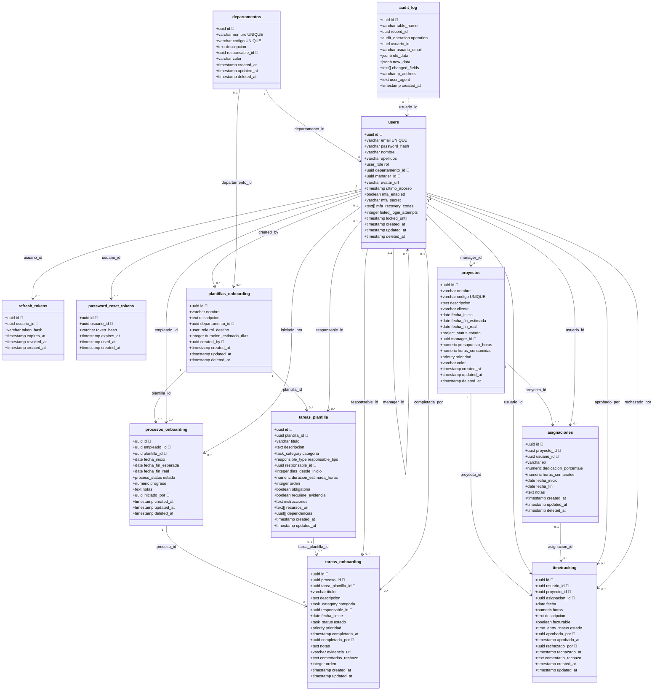

# Estructura de Base de Datos - TeamHub

Documentación completa del modelo de datos de TeamHub.

## Convenciones

| Convención | Descripción |
|------------|-------------|
| **PK** | UUID generado con `gen_random_uuid()` |
| **Timestamps** | `created_at`, `updated_at` (con timezone) |
| **Soft delete** | Columna `deleted_at` (timestamp nullable) |
| **Nombres** | snake_case para tablas y columnas |
| **Índices** | Prefijo `idx_` o `unique_` según tipo |

## Resumen de Tablas

| # | Tabla | Descripción | Registros típicos | Fase |
|---|-------|-------------|-------------------|------|
| 1 | `users` | Usuarios del sistema | 100-1000 | 1 |
| 2 | `refresh_tokens` | Tokens de refresco JWT | Miles | 1 |
| 3 | `password_reset_tokens` | Tokens para reset password | Cientos | 1 |
| 4 | `departamentos` | Departamentos de la empresa | 5-20 | 2 |
| 5 | `plantillas_onboarding` | Plantillas reutilizables | 10-50 | 3 |
| 6 | `tareas_plantilla` | Tareas de plantillas | 100-500 | 3 |
| 7 | `procesos_onboarding` | Procesos instanciados | Cientos | 3 |
| 8 | `tareas_onboarding` | Tareas de procesos | Miles | 3 |
| 9 | `proyectos` | Proyectos de la empresa | 50-200 | 4 |
| 10 | `asignaciones` | Asignaciones usuario-proyecto | Cientos | 4 |
| 11 | `timetracking` | Registros de tiempo | Miles | 5 |
| 12 | `audit_log` | Auditoría de operaciones | Millones | 1 |

## Diagrama Entidad-Relación

```
┌─────────────────────────────────────────────────────────────────────────────┐
│                              USUARIOS Y AUTH                                 │
├─────────────────────────────────────────────────────────────────────────────┤
│                                                                              │
│   ┌──────────────────┐     ┌────────────────────┐     ┌──────────────────┐  │
│   │  refresh_tokens  │     │       users        │     │password_reset_   │  │
│   ├──────────────────┤     ├────────────────────┤     │    tokens        │  │
│   │ usuario_id (FK)──┼────►│ id (PK)            │◄────┼──usuario_id (FK) │  │
│   │ token_hash       │     │ email (UNIQUE)     │     │ token_hash       │  │
│   │ expires_at       │     │ password_hash      │     │ expires_at       │  │
│   │ revoked_at       │     │ nombre, apellidos  │     │ used_at          │  │
│   └──────────────────┘     │ rol (ENUM)         │     └──────────────────┘  │
│                            │ departamento_id ───┼──┐                        │
│                            │ manager_id (self)──┼──┼─┐                      │
│                            │ mfa_*, locked_*    │  │ │                      │
│                            │ deleted_at         │  │ │                      │
│                            └────────────────────┘  │ │                      │
│                                     ▲              │ │                      │
│                                     │              │ │                      │
└─────────────────────────────────────┼──────────────┼─┼──────────────────────┘
                                      │              │ │
┌─────────────────────────────────────┼──────────────┼─┼──────────────────────┐
│                           DEPARTAMENTOS            │ │                      │
├─────────────────────────────────────┼──────────────┼─┼──────────────────────┤
│                                     │              │ │                      │
│   ┌─────────────────────────────────┼──────────────┘ │                      │
│   │                                 │                │                      │
│   │   ┌────────────────────┐        │                │                      │
│   └──►│   departamentos    │        │                │                      │
│       ├────────────────────┤        │                │                      │
│       │ id (PK)            │◄───────┘                │                      │
│       │ nombre (UNIQUE)    │                         │                      │
│       │ codigo (UNIQUE)    │                         │                      │
│       │ responsable_id (FK)┼─────────────────────────┘                      │
│       │ color              │                                                │
│       │ deleted_at         │                                                │
│       └────────────────────┘                                                │
│                                                                              │
└──────────────────────────────────────────────────────────────────────────────┘

┌──────────────────────────────────────────────────────────────────────────────┐
│                              ONBOARDING                                       │
├──────────────────────────────────────────────────────────────────────────────┤
│                                                                               │
│   ┌────────────────────────┐         ┌────────────────────────┐              │
│   │ plantillas_onboarding  │         │   tareas_plantilla     │              │
│   ├────────────────────────┤   1:N   ├────────────────────────┤              │
│   │ id (PK)                │◄────────┤ plantilla_id (FK)      │              │
│   │ nombre                 │         │ titulo                 │              │
│   │ departamento_id (FK)───┼──►deps  │ categoria (ENUM)       │              │
│   │ rol_destino (ENUM)     │         │ responsable_tipo (ENUM)│              │
│   │ duracion_estimada_dias │         │ responsable_id (FK)────┼──►users     │
│   │ created_by (FK)────────┼──►users │ dias_desde_inicio      │              │
│   │ deleted_at             │         │ dependencias (UUID[])  │              │
│   └────────────────────────┘         └────────────────────────┘              │
│              │                                    │                          │
│              │ 1:N                                │ 1:N                      │
│              ▼                                    ▼                          │
│   ┌────────────────────────┐         ┌────────────────────────┐              │
│   │  procesos_onboarding   │         │   tareas_onboarding    │              │
│   ├────────────────────────┤   1:N   ├────────────────────────┤              │
│   │ id (PK)                │◄────────┤ proceso_id (FK)        │              │
│   │ empleado_id (FK)───────┼──►users │ tarea_plantilla_id(FK) │              │
│   │ plantilla_id (FK)      │         │ titulo                 │              │
│   │ fecha_inicio           │         │ responsable_id (FK)────┼──►users     │
│   │ estado (ENUM)          │         │ estado (ENUM)          │              │
│   │ progreso (0-100)       │         │ prioridad (ENUM)       │              │
│   │ iniciado_por (FK)──────┼──►users │ completada_por (FK)────┼──►users     │
│   │ deleted_at             │         │ evidencia_url          │              │
│   └────────────────────────┘         └────────────────────────┘              │
│                                                                               │
└───────────────────────────────────────────────────────────────────────────────┘

┌───────────────────────────────────────────────────────────────────────────────┐
│                         PROYECTOS Y TIMETRACKING                              │
├───────────────────────────────────────────────────────────────────────────────┤
│                                                                                │
│   ┌────────────────────────┐         ┌────────────────────────┐               │
│   │      proyectos         │         │     asignaciones       │               │
│   ├────────────────────────┤   1:N   ├────────────────────────┤               │
│   │ id (PK)                │◄────────┤ proyecto_id (FK)       │               │
│   │ nombre                 │         │ usuario_id (FK)────────┼──►users      │
│   │ codigo (UNIQUE)        │         │ rol                    │               │
│   │ manager_id (FK)────────┼──►users │ dedicacion_porcentaje  │               │
│   │ estado (ENUM)          │         │ fecha_inicio           │               │
│   │ presupuesto_horas      │         │ deleted_at             │               │
│   │ horas_consumidas ◄─────┼─trigger─┤                        │               │
│   │ deleted_at             │         └────────────────────────┘               │
│   └────────────────────────┘                    │                             │
│              │                                  │ 1:N                         │
│              │ 1:N                              ▼                             │
│              ▼                       ┌────────────────────────┐               │
│   ┌────────────────────────┐         │     timetracking       │               │
│   │    (ver timetracking)  │         ├────────────────────────┤               │
│   └────────────────────────┘         │ id (PK)                │               │
│                                      │ usuario_id (FK)────────┼──►users      │
│                                      │ proyecto_id (FK)       │               │
│                                      │ asignacion_id (FK)     │               │
│                                      │ fecha                  │               │
│                                      │ horas (CHECK 0-24)     │               │
│                                      │ estado (ENUM)          │               │
│                                      │ aprobado_por (FK)──────┼──►users      │
│                                      │ rechazado_por (FK)─────┼──►users      │
│                                      └────────────────────────┘               │
│                                                                                │
└────────────────────────────────────────────────────────────────────────────────┘

┌────────────────────────────────────────────────────────────────────────────────┐
│                              AUDITORÍA                                          │
├────────────────────────────────────────────────────────────────────────────────┤
│                                                                                 │
│   ┌────────────────────────────┐                                               │
│   │        audit_log           │◄── Trigger automático en todas las tablas    │
│   ├────────────────────────────┤                                               │
│   │ id (PK)                    │                                               │
│   │ table_name                 │                                               │
│   │ record_id                  │                                               │
│   │ operation (INSERT/UPDATE/DELETE)                                           │
│   │ usuario_id (FK)────────────┼──►users (quien hizo la operación)            │
│   │ usuario_email              │   (copia para referencia histórica)           │
│   │ old_data (JSONB)           │                                               │
│   │ new_data (JSONB)           │                                               │
│   │ changed_fields (TEXT[])    │                                               │
│   │ ip_address                 │                                               │
│   │ user_agent                 │                                               │
│   │ created_at                 │                                               │
│   └────────────────────────────┘                                               │
│                                                                                 │
└─────────────────────────────────────────────────────────────────────────────────┘
```

## Diagrama UML (Mermaid)

Leyenda: 🔑 PK, 🔗 FK



## Enums PostgreSQL

### user_role
Roles de usuario en el sistema.

| Valor | Descripción | Permisos principales |
|-------|-------------|---------------------|
| `ADMIN` | Administrador | Acceso total |
| `RRHH` | Recursos Humanos | Gestión empleados y onboarding |
| `MANAGER` | Manager | Gestión de equipo y proyectos |
| `EMPLEADO` | Empleado | Acceso self-service |

### task_category
Categorías de tareas de onboarding.

| Valor | Descripción |
|-------|-------------|
| `DOCUMENTACION` | Firma de contratos, políticas |
| `EQUIPAMIENTO` | Laptop, teléfono, tarjeta acceso |
| `ACCESOS` | Email, VPN, herramientas |
| `FORMACION` | Cursos, certificaciones |
| `REUNIONES` | Presentaciones, one-on-ones |
| `ADMINISTRATIVO` | Alta en sistemas, nómina |

### responsible_type
Tipo de responsable en plantilla de tarea.

| Valor | Descripción |
|-------|-------------|
| `RRHH` | Alguien de RRHH |
| `MANAGER` | El manager del empleado |
| `IT` | Alguien de IT |
| `EMPLEADO` | El propio empleado |
| `CUSTOM` | Usuario específico (responsable_id) |

### process_status
Estado del proceso de onboarding.

| Valor | Descripción |
|-------|-------------|
| `EN_CURSO` | Proceso activo |
| `COMPLETADO` | Todas las tareas finalizadas |
| `CANCELADO` | Proceso cancelado |
| `PAUSADO` | Proceso temporalmente detenido |

### task_status
Estado de tarea de onboarding.

| Valor | Descripción |
|-------|-------------|
| `PENDIENTE` | Esperando ser iniciada |
| `EN_PROGRESO` | En ejecución |
| `COMPLETADA` | Finalizada |
| `BLOQUEADA` | Bloqueada por dependencias |
| `CANCELADA` | Cancelada |

### priority
Prioridad de tareas y proyectos.

| Valor | Descripción |
|-------|-------------|
| `BAJA` | Puede esperar |
| `MEDIA` | Normal |
| `ALTA` | Importante |
| `URGENTE` | Crítico, atención inmediata |

### project_status
Estado del proyecto.

| Valor | Descripción |
|-------|-------------|
| `PLANIFICACION` | En fase de planificación |
| `ACTIVO` | En ejecución |
| `PAUSADO` | Temporalmente detenido |
| `COMPLETADO` | Finalizado |
| `CANCELADO` | Cancelado |

### time_entry_status
Estado del registro de tiempo.

| Valor | Descripción |
|-------|-------------|
| `PENDIENTE` | Esperando aprobación |
| `APROBADO` | Aprobado por manager |
| `RECHAZADO` | Rechazado, requiere corrección |

### audit_operation
Tipo de operación de auditoría.

| Valor | Descripción |
|-------|-------------|
| `INSERT` | Creación de registro |
| `UPDATE` | Modificación de registro |
| `DELETE` | Eliminación de registro |

## Triggers

### 1. updated_at automático
- **Función**: `trigger_set_updated_at()`
- **Evento**: BEFORE UPDATE
- **Tablas**: Todas las que tienen `updated_at`
- **Acción**: Actualiza `updated_at = CURRENT_TIMESTAMP`

### 2. Auditoría global
- **Función**: `trigger_audit_log()`
- **Evento**: AFTER INSERT, UPDATE, DELETE
- **Tablas**: Todas (excepto `audit_log`)
- **Acción**: Registra operación en `audit_log`
- **Excluye campos**: `password_hash`, `mfa_secret`, `mfa_recovery_codes`, `token_hash`
- **Contexto**: Usa variables de sesión `app.current_user_id`, `app.current_user_email`, `app.client_ip`, `app.user_agent`

### 3. Horas consumidas en proyectos
- **Función**: `trigger_update_proyecto_horas()`
- **Evento**: AFTER INSERT, UPDATE, DELETE
- **Tabla**: `timetracking`
- **Acción**: Recalcula `horas_consumidas` sumando registros APROBADOS

### 4. Progreso de proceso de onboarding
- **Función**: `trigger_update_proceso_progreso()`
- **Evento**: AFTER INSERT, UPDATE OF estado, DELETE
- **Tabla**: `tareas_onboarding`
- **Acción**:
  - Recalcula `progreso` = (completadas / total) * 100
  - Auto-completa proceso si progreso = 100%

## Índices

### Índices principales por tabla

| Tabla | Índice | Tipo | Columnas |
|-------|--------|------|----------|
| users | `users_email_idx` | UNIQUE | email |
| users | `users_departamento_idx` | B-tree | departamento_id |
| users | `users_manager_idx` | B-tree | manager_id |
| users | `users_rol_idx` | B-tree | rol |
| users | `users_deleted_at_idx` | B-tree | deleted_at |
| departamentos | `departamentos_nombre_idx` | UNIQUE | nombre |
| departamentos | `departamentos_codigo_idx` | UNIQUE | codigo |
| proyectos | `proyectos_codigo_idx` | UNIQUE | codigo |
| asignaciones | `asignaciones_proyecto_usuario_fecha_unique` | UNIQUE | (proyecto_id, usuario_id, fecha_inicio) |
| timetracking | `timetracking_usuario_fecha_idx` | B-tree | (usuario_id, fecha) |
| timetracking | `timetracking_descripcion_trgm_idx` | GIN | descripcion (trigram) |
| audit_log | `audit_log_table_record_idx` | B-tree | (table_name, record_id) |
| audit_log | `audit_log_usuario_created_idx` | B-tree | (usuario_id, created_at) |

## Constraints

### CHECK constraints

| Tabla | Constraint | Condición |
|-------|------------|-----------|
| timetracking | `timetracking_horas_check` | `horas > 0 AND horas <= 24` |

### Foreign Keys con comportamiento especial

| Tabla | FK | ON DELETE |
|-------|-----|-----------|
| users | departamento_id | SET NULL |
| users | manager_id | SET NULL |
| refresh_tokens | usuario_id | CASCADE |
| password_reset_tokens | usuario_id | CASCADE |
| departamentos | responsable_id | SET NULL |
| plantillas_onboarding | created_by | RESTRICT |
| tareas_plantilla | plantilla_id | CASCADE |
| procesos_onboarding | empleado_id | RESTRICT |
| procesos_onboarding | plantilla_id | RESTRICT |
| tareas_onboarding | proceso_id | CASCADE |
| asignaciones | proyecto_id | CASCADE |
| asignaciones | usuario_id | CASCADE |
| timetracking | usuario_id | RESTRICT |
| timetracking | proyecto_id | RESTRICT |

## Comandos de Base de Datos

```bash
# Generar migración desde cambios en schema
npm run db:generate

# Ejecutar migraciones pendientes
npm run db:migrate

# Ejecutar triggers (después de migraciones)
npm run db:triggers

# Cargar datos de prueba
npm run db:seed

# Setup completo (migrate + triggers + seed)
npm run db:setup

# Abrir Drizzle Studio (GUI)
npm run db:studio
```

## Notas de Implementación

### Soft Delete
- La mayoría de tablas de dominio usan `deleted_at` en lugar de eliminación física (por ejemplo: `users`, `departamentos`, `plantillas_onboarding`, `procesos_onboarding`, `proyectos`, `asignaciones`).
- Excepciones actuales: `tareas_plantilla` y `timetracking` no tienen `deleted_at`, y `audit_log` es inmutable.
- Los queries deben filtrar `WHERE deleted_at IS NULL` para registros activos y exponer `activo` en la API como derivado.
- Los triggers de auditoría registran UPDATE cuando se marca `deleted_at` (no DELETE físico).

### Contexto de Auditoría
La aplicación debe establecer variables de sesión antes de operaciones:

```sql
SET LOCAL app.current_user_id = 'uuid-del-usuario';
SET LOCAL app.current_user_email = 'email@example.com';
SET LOCAL app.client_ip = '192.168.1.1';
SET LOCAL app.user_agent = 'Mozilla/5.0...';
```

Ver `src/db/audit-context.ts` para helpers de TypeScript.

### Campos Virtuales (resueltos via JOIN)

Los siguientes campos no existen en la BD sino que se resuelven en tiempo de consulta mediante LEFT JOIN:

| Endpoint | Campo virtual | Origen |
|----------|--------------|--------|
| `GET /usuarios/:id`, `GET /usuarios` | `departamentoNombre` | `departamentos.nombre` via LEFT JOIN |
| `GET /usuarios/:id`, `GET /usuarios` | `managerNombre` | Self-JOIN en `users` con alias `managers` |
| `GET /dashboard/manager` (pendientes) | `usuarioNombre` | LEFT JOIN con `users` |
| `GET /dashboard/manager` (pendientes) | `proyectoNombre` | LEFT JOIN con `proyectos` |

El patrón de self-JOIN usa `alias()` de Drizzle ORM para resolver la relación reflexiva `users.manager_id` → `users`.

### Campos Sensibles
Los siguientes campos se excluyen del log de auditoría:
- `password_hash`
- `mfa_secret`
- `mfa_recovery_codes`
- `token_hash`
