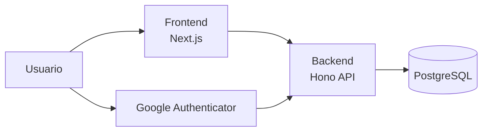

# SAD - Software Architecture Document (TeamHub)

## 1. Objetivo
Definir la arquitectura de TeamHub para alinear diseño, desarrollo y despliegue con los requisitos del TFM.

## 2. Alcance
- Frontend: Next.js 15 (App Router) + React 19 + TypeScript 5.7.
- Backend: Node.js 20 + Hono 4.6 + Drizzle ORM 0.38.
- Base de datos: PostgreSQL 16.
- Testing: Vitest 3 + Testing Library.
- Linting: ESLint 9 (flat config).
- Autenticacion: JWT + bcrypt + MFA TOTP (Google Authenticator).

## 3. Contexto y restricciones
- Acceso interno: creacion de usuarios solo por ADMIN.
- MFA obligatorio para todos los usuarios en el primer login.
- Password policy fuerte (min 12, mayus/minus/numero/especial).
- Bloqueo tras 3 intentos fallidos (30 min) con desbloqueo manual por ADMIN.
- Rate limit en login (5 req/min IP) y global (100 req/min usuario).

## 4. Arquitectura de alto nivel

```text
[Usuario] -> [Frontend Next.js] -> [Backend Hono] -> [PostgreSQL]
                      |
                      +-> [MFA TOTP] (Google Authenticator)
```

Diagrama (fuente): `docs/architecture/architecture-diagram.mmd`



## 5. Componentes principales

### 5.1 Frontend
- App Router con rutas publicas y privadas.
- UI con Tailwind CSS y shadcn/ui.
- Estado server con TanStack Query.
- Visualizaciones con D3.js.

### 5.2 Backend
- Hono como framework HTTP.
- Drizzle ORM para acceso a datos.
- Middlewares: auth, validacion Zod y manejo de errores.
- Logging estructurado con pino.

### 5.3 Base de datos
- PostgreSQL 16.
- Soft delete en entidades criticas.
- Relaciones clave: usuarios -> departamentos/manager, procesos -> plantillas, proyectos -> asignaciones.

## 6. Modelo de datos (resumen)
- Usuarios y roles: ADMIN, RRHH, MANAGER, EMPLEADO.
- Departamentos.
- Onboarding: plantillas, tareas, procesos y tareas de proceso.
- Proyectos y asignaciones.
- Timetracking: registros de horas con estado.

## 7. Contratos e integraciones
- Contrato API en `openapi.yaml` (modularizado en `docs/api/openapi/`).
- Swagger UI para visualizacion y validacion.

## 8. Seguridad
- JWT con expiracion y refresh token.
- Passwords hasheados con bcrypt (salt rounds 12).
- MFA obligatorio (TOTP).
- CORS limitado a dominios permitidos.
- Validacion de inputs con Zod en todos los endpoints.

## 9. Observabilidad
- Logs estructurados con pino.
- Respuestas de error estandarizadas.

## 10. Calidad y testing
- Backend: Vitest + pruebas de endpoints con `app.request`.
- Frontend: Vitest + Testing Library.
- E2E: Playwright.

## 11. Despliegue
- Frontend en Vercel.
- Backend en Railway.
- PostgreSQL en Railway o local via Docker (desarrollo).

## 12. Riesgos y mitigaciones
- Complejidad de flujos de onboarding -> uso de plantillas y estados.
- Seguridad de acceso -> MFA obligatorio y bloqueo por intentos.
- Visibilidad por rol -> middleware y filtros server-side.

## 13. Referencias
- Decisiones: `docs/decisiones.md`.
- Funcional frontend: `docs/frontend/funcional.md`.
- Tecnico frontend: `docs/frontend/tecnico.md`.
- Funcional backend: `docs/backend/funcional.md`.
- Tecnico backend: `docs/backend/tecnico.md`.
- Variables de entorno: `docs/architecture/env-vars.md`.
- Base de datos: `docs/architecture/database-schema.md`.
- Despliegue y CI/CD: `docs/architecture/deploy.md`.
- Testing y calidad: `docs/quality/testing.md`.
